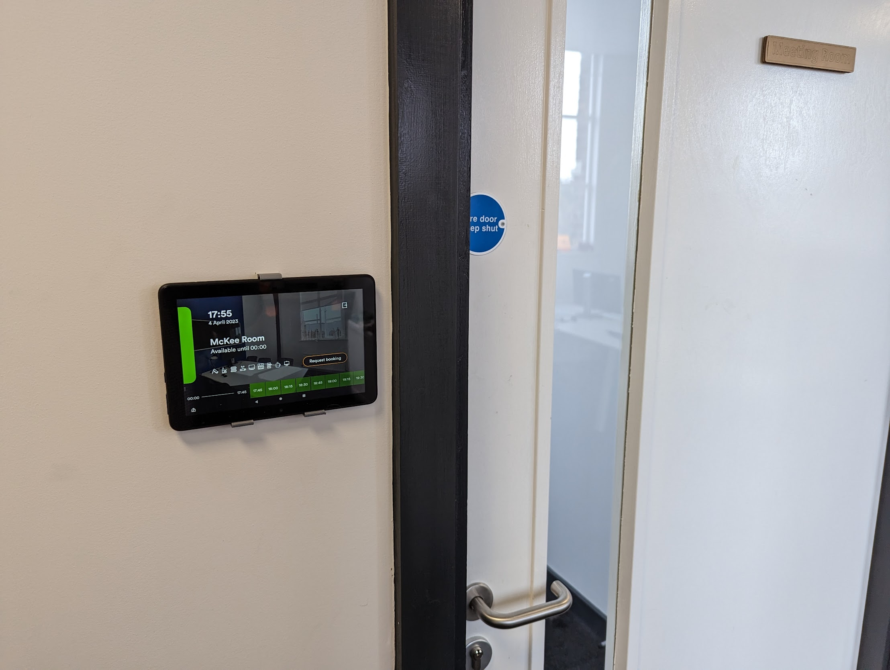
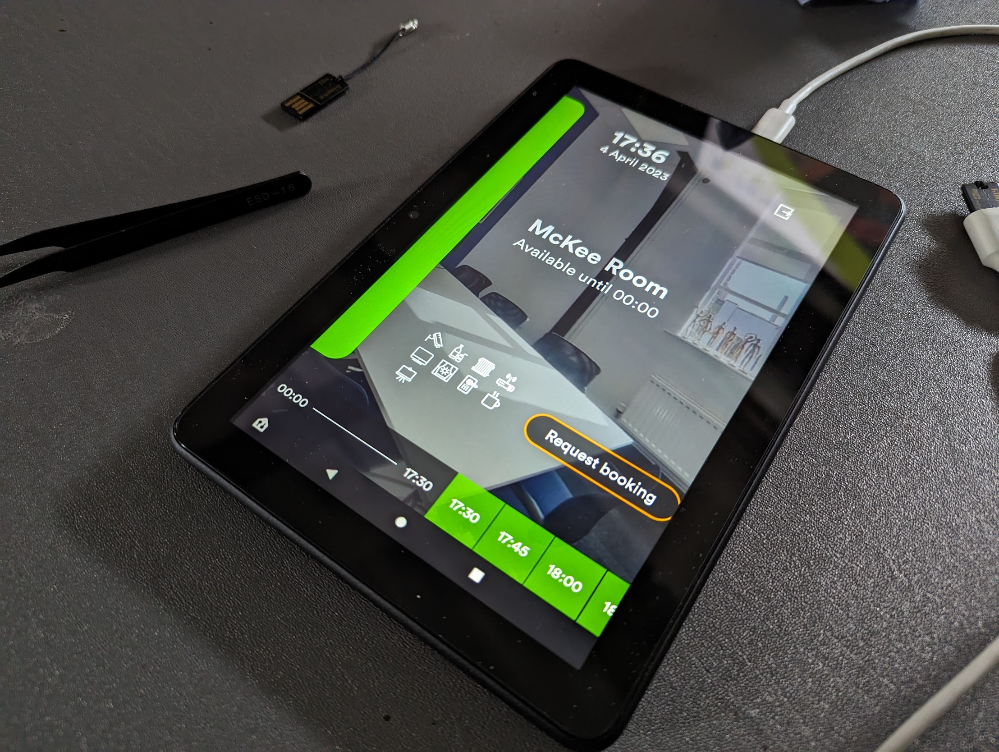

# Nexudus

Membership management system

## Room Booking Displays

Bookable resources display their schedule on a tablet, showing people when that resource is available.

Resources _can_ be booked but this requires entering your Nexudus username and password to a public device so YMMV...

### Registered Devices

|Device ID | Resource|
| - | - |
| 6c64dc4-9b57a39a | Event Space |
| e772bc96-b18cc64c | McKee Room |

### Onboarding a new device

Normally, this should be as easy as downloading ['NexBoard'](https://www.nexudus.com/apps/nexboard/) and ['Fully Kiosk Single App'](https://www.fully-kiosk.com/) from the relevant app store... Unless...

#### Onboarding a new Amazon Fire device

(They were on sale :shrug:) 

If you got an Amazon Fire tablet, good for you; but...

DO NOT REGISTER AN ACCOUNT TO THE DEVICE; get to the "Select Wifi" page on setup hit Select WiFi, but do not select a network, hit cancel and back, you should have a skip available to move forward. 

Once you're at a regular looking Android launcher screen, then you can join the device to the 'farset-devices' Wifi.

Then, using the files in [this folder](../assets/), transfer and install the 'NexBoard[...].apk' and 'Fully-Kiosk-Browser[...].apk'. Or find updated APK's or whatever you like.

The Wifi is throttled so this may take a while. 

#### Moving on...

Once NexBoard and Fully Kiosk are installed, fire up NexBoard, sign in with the 'signage@farsetlabs.org.uk' account, select the relevant resource that this display is going to be associated with. 

Then, fire up Fully Kiosk, set the 'Exit Pin' to the same as the doorcode, use 'Select App' to select 'NexBoard', then swipe from the left to jump into the settings and go for "Get a PLUS License". Take the device id listed and navigate to [here](https://license.fully-kiosk.com/license/) to register a new single device against the admin@farsetlabs.org.uk PayPal account. This is a one time license so there's no recurring cost.

Then, swipe left again to drop into the 'Settings', and in 'Kiosk Mode' activate 'Enable Kiosk Mode, check 'Wait for Boot Completed', turn off 'Test Mode'. Then, in 'Device Management', turn on 'Launch on Boot', set the device name to something like '<resourcename>-tablet', then find the MQTT settings, enable it, and set the Borker URL to 'tcp://mqtt.farsetlabs.org.uk:1883' and enable the Daily Usage Statistics and Environment Sensors.

Then go through the relevant permissions requests, close out of all that, then reopen Fully Kiosk, and Start Kiosk mode, and you should be opened directly into a screen like this.

Now just find somewhere to mount it and give it a source of power, and you should be golden! 

### Mounting for Fire 8 HD 2020

[Thingiverse File](https://www.thingiverse.com/thing:4770658)

