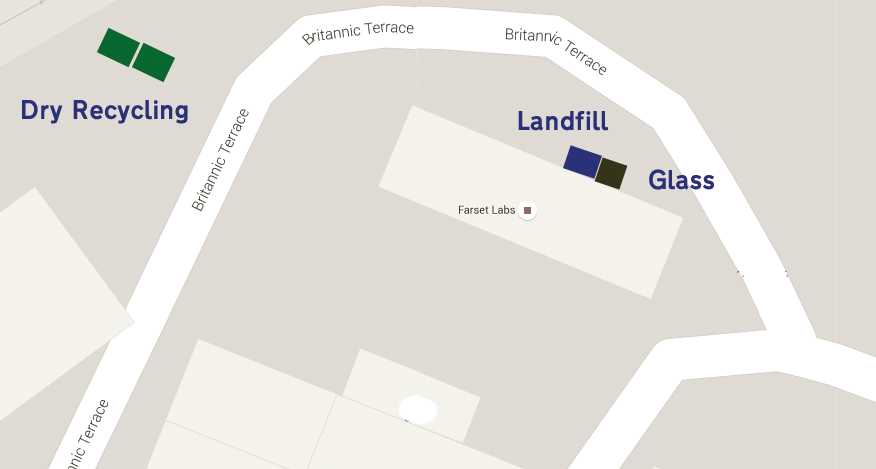
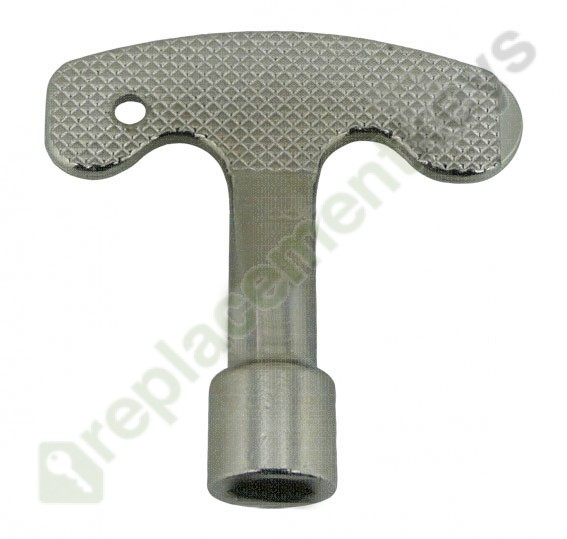

# Bins

To empty the bins, waste should be taken to the appropriate location below

| Material                              | Destination         | Owner/Operator |
| ------------------------------------- | ------------------- | -------------- |
| Paper and Cardboard (Bagged or boxed) | Dry Recycling Bins  | Weavers Court  |
| Cans and Plastic Bottles (Bagged)     | Dry Recycling Bins  | Weavers Court  |
| Glass Bottles                         | Glass Recycling Bin | Farset Labs    |
| Mixed Waste / Contaminated Recycling  | Landfill Bin        | Farset Labs    |

Note: The Landfill bin should be kept locked. To open it, use the key from the post management desk

> Originally adapted from [this](https://docs.google.com/document/d/1aB_I0ePniSR7BgisH5xoVdP1_8oSA1kPInxsomsjeqo/edit#) google doc
