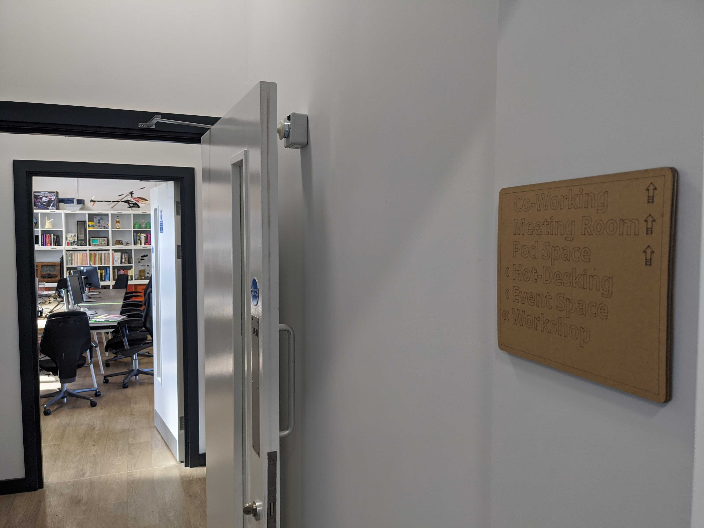
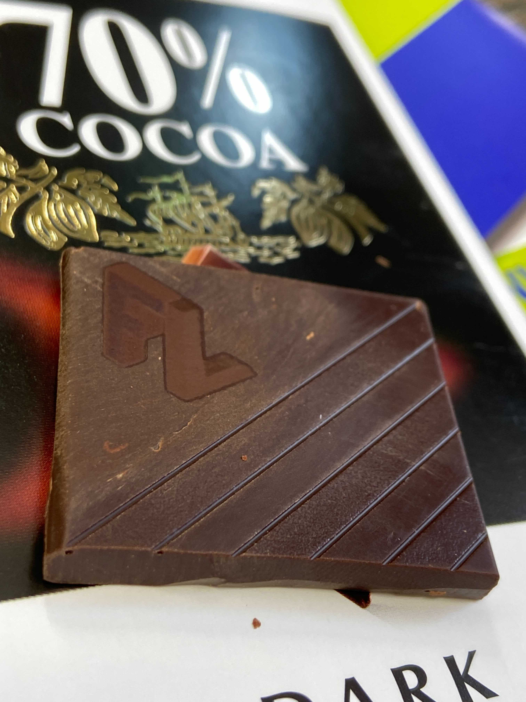

# Laser Safe Materials

Lasers are fun, but not everything can or should be used for laser cutting/engraving. 

For all our collective safety, sanity, and security, this is the canonical list of materials/settings that can be used with the Glowforge laser cutter.

If you want to change or add to this list, raise a PR, discuss it in #laser-cutter in the [Slack](https://slackin.farsetlabs.org.uk) and make your case.

| Material                         | Notes                                                        | Link                                |
| -------------------------------- | ------------------------------------------------------------ | ----------------------------------- |
| Proofgrade :tm: materials        | Material Auto calibration via the [Glowforge app](app.glowforge.com/) | [Shop](https://shop.glowforge.com/) |
| Corrugated Cardboard (2/3 layer) | Club Mate Boxes are great Experimental Materials             |                                     |
| Cardboard Notebooks/etc          | Engrave / Score only                                         |                                     |
| Chocolate                        | Engrave only, YMMV                                           |                                     |

## 'Known Good' Settings for Non-Proofgrade Materials

### Cardboard

Settings contributed by @bolster

Club Mate boxes are a renewable resource!

The 'Engrave' and 'Score' settings can also be used for any cardboard covered 'things' (such as notebooks) but YMMV

| Effect  | Speed | Power | Notes                                                        |
| ------- | ----- | ----- | ------------------------------------------------------------ |
| Engrave | 1000  | 40    | Ensure 'Vary Power' is checked                               |
| Cut     | 300   | 60    | Depending on the thickness of the cardboard, it's better to make multiple cuts than raise the power |
| Score   | 300   | 40    |                                                              |

### Chocolate

Settings contributed by @Caolan

Tested on Cadburys Dark Milk. YMMV

| Effect  | Speed | Power | Notes                          |
| ------- | ----- | ----- | ------------------------------ |
| Engrave | 1000  | 25    | Ensure 'Vary Power' is checked |

# Really Properly Unsafe _Never Use Me_ materials, and why

Stolen with love from the [ATX Hackerspace](http://atxhackerspace.org/wiki/Laser_Cutter_Materials#NEVER_CUT_THESE_MATERIALS) 

**HINT**: This linked source page would be a reasonable starting point for adding new materials to the approved list above, but presence in the ATX list does not guarantee safety in our case.

| Material                                                     | DANGER!                                                      | Cause/Consequence                                            |
| ------------------------------------------------------------ | ------------------------------------------------------------ | ------------------------------------------------------------ |
| PVC (Poly Vinyl Chloride)/vinyl/pleather/artificial leather  | Emits chlorine gas when cut! :skull:                         | Don't ever cut this material as it will ruin the optics, causes the metal of the machine to corrode as chlorine is released and ruins the  motion control system. |
| Thick ( >1mm ) Polycarbonate/Lexan                           | Cuts very poorly, discolours, catches fire :fire:            | Polycarbonate is often found as flat, sheet material. The window of the laser cutter is made of Polycarbonate because *polycarbonate strongly absorbs infrared radiation!* This is the frequency of light the laser cutter uses to cut materials,  so it is very ineffective at cutting polycarbonate. Polycarbonate is a  poor choice for laser cutting.  It creates long stringy clouds of soot  that float up, ruin the optics and mess up the machine. |
| ABS                                                          | Melts :volcano: / Cyanide :skull:                            | ABS does not cut well in a laser cutter. It tends to melt rather  than vaporize, and has a higher chance of catching on fire and leaving  behind melted gooey deposits on the vector cutting grid. It also does  not engrave well (again, tends to melt).  Cutting ABS plastic emits  hydrogen cyanide, which is unsafe at any concentration. |
| HDPE/milk bottle plastic                                     | Catches fire :fire: and melts :volcano:                      | It melts. It gets gooey. It catches fire. Don't use it.      |
| Polystyrene Foam                                             | Catches fire :fire:                                          | It catches fire quickly, burns rapidly, it melts, and only thin pieces cut. This is the #1 material that causes laser fires!!! |
| Polypropylene Foam                                           | Catches fire :fire:                                          | Like Polystyrene, it melts, catches fire, and the melted drops continue to burn and turn into rock-hard drips and pebbles. |
| Epoxy                                                        | burn / smoke :skull: :cloud:                                 | Epoxy is an aliphatic resin, strongly cross-linked carbon chains.  A CO2 laser can't cut it, and the resulting burned mess creates toxic  fumes ( like cyanide! ).  Items coated in Epoxy, or cast Epoxy resins  must not be used in the laser cutter. ( see Fiberglass ) |
| Fiberglass                                                   | Emits fumes :skull: :cloud:                                  | It's a mix of two materials that cant' be cut. Glass (etch, no cut) and epoxy resin (fumes) |
| Coated Carbon Fiber                                          | Emits noxious fumes :skull: :cloud:                          | A mix of two materials. Thin carbon fiber mat can be cut, with some fraying - but not when coated. |
| Any foodstuff ( such as meat, seaweed 'nori' sheets, cookie dough, bread, tortillas... ) | The laser is not designed to cut food, and people cut things that  create poisonous/noxious substances such as wood smoke and acrylic  smoke. :warning: | If you want to cut foodstuffs, consider sponsoring a food-only  laser cutter for the space that is kept as clean as a commercial kitchen would require. |
| Material with Sticky Glue Backing                            | Coats lens, cracks lens :warning::exclamation:               | There are many **normally** laserable items such as thin wood  laminates that you can purchase that become un-cuttable when the  manufacturer adds a layer of peel-off glue on the bottom to attach them  to surfaces.  Examples include cork tiles, thin wood laminate, acrylic  tiles, and paper stickers.  Never cut these materials in the laser  cutter if they have this backing.  The glue will vaporize forming a  coating on the lens that will coat it, cloud it, heat it, and then  potentially crack the lens. The glue residue is worse than resin, and  can't be removed without risking damage to the lens ... requiring a lens replacement. |

