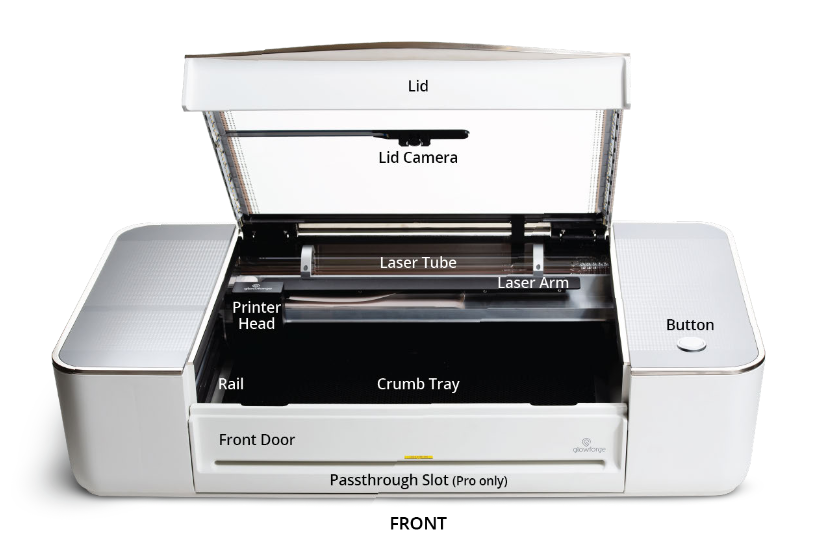
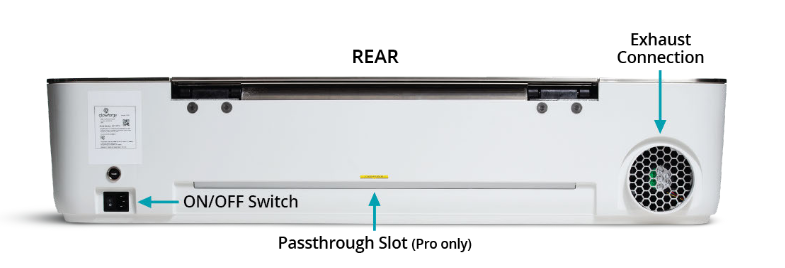
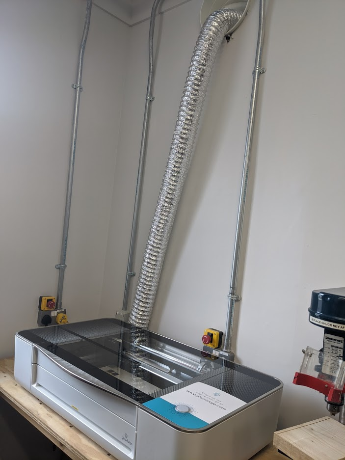
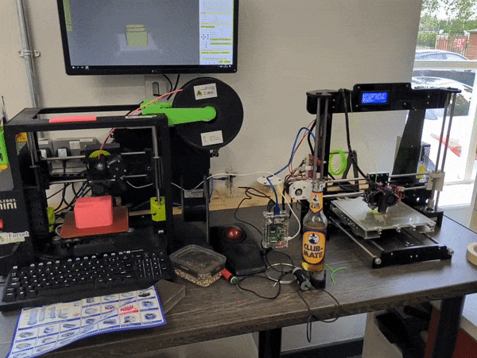

# Workshop Induction

The workshop induction program is there to ensure a new users can use the [Workshop Equipment](equipment.md) safely and effectively.

The majority of advanced manufacturing equipment was paid for by the dues of fellow members, and some of that equipment can be dangerous if misused or neglected, so should be treated with respect and care.

This induction is currently free of charge and is provided on a voluntary basis fortnightly.

## Who can be inducted to use the workshop?

* Farset Labs Members
* Guests of a Named Farset Labs Member

## Who can induct people into the use of the Workshop

* Currently [Trained](trained.md) Farset Labs Members

(Guests cannot induct others)

## How to book an induction

Inductions happen on a fortnightly basis.

:calendar:[Book an appointment here.](https://calendar.google.com/calendar/u/0/selfsched?sstoken=UUw1ZG5SQmk3NlNlfGRlZmF1bHR8OWFhMTM0M2FiNDlkMjEwMmJjOTQ5YmQ3ZTA1MWFlNzk)

'Exceptional' inductions can be arranged on a case by case basis by [inducted](inducted.md) individuals who are current members of Farset Labs.

# General Workshop Guidance

* Tidy up after yourself
* If the space is not tidy before you start work, tidy it anyway
  * Passive-aggressively shaming prior users is optional... but keep calm and [AGF](https://en.wikipedia.org/wiki/Wikipedia:Assume_good_faith)
* Put any tools/equipment back where they belong
  * Not all tools have an obvious place where they should live, in which case, leave them back where you found them
  * If you think there is a better place to put a particular tool, or a better way to arrange things, discuss it in the #facilities room on [Slack](https://farsetlabs.slack.com)
* Do not enter the workshop while under the influence of alcohol, recreational drugs, or medication that may impair your ability to work safely
* If someone else is working in the workshop, ask if your planned work would impair their current work (first come first serve principle)

## General Induction Checklist

- [ ] Knows where the fire extinguishers are
- [ ] Knows where the first aid kits / eye wash kits are located
- [ ] Is aware of the conditions and requirements for inducting other people
- [ ] Is aware that it is their responsibility to stop and remove non-inducted people from working in the workshop

# Laser Cutter

The GlowForge Pro is a Class 4 laser product, emitting enough infrared light to cause instant skin and eye injury, or start a fire. 

This infrared light is invisible.

The Unit has a case and glass lid that block harmful levels of infrared and UV light, allowing the unit to be operated safely without additional protections.

**If there appears to be any damage to the glass or the case, do not use the laser cutter and notify the management team immediately**

Safety interlock switches on the front door will turn off the laser immediately if the lid is opened. 

## The Context

The [GlowForge](https://glowforge.com/our-products/pro) was half-funded by the [Halifax Foundation](https://www.halifaxfoundationni.org/programmes/community-grant-programme) under their Community Grants programme, where £4000 of the £7000 necessary funding required to get the laser cutter. The remainder was made up from general charity funds for the following purposes: 

* Provide Laser Cutting Facility available to the community
* Generate and Deliver Education and Safety Training to at least 50 individuals in the local community in 2020/2021 (Including CoderDojo-suitable activities)
* Publication of >5 "Build Guides"

The initially stated measure of success of the grant were:

* Total Hours of Operation
* Total External Booking Hours
* Number of Inducted Persons 
* Number of Published Build-Guides

The inline power monitor ([ESPURNA-B60BBA](https://grafana.farsetlabs.org.uk/d/pBIm9WzGz/power-monitoring?orgId=1)) is used to monitor the usage of the laser cutter. It is in the 'fixed-on' configuration so power should be switched from the rear of the laser-cutter.

## The Rules

* **Do not** leave the laser cutter unattended when in operation
  * Most cuts are relatively fast anyway (<30min for A4 engraving) 
* **Do not** put **any** material in the laser cutter bed that you are not **positive** is [laser safe](laser_cutter_materials.md)
* **Do not** touch the head or arm of the laser cutter while the power is on; if you do by accident, restart the unit to prevent possible damage
* **Do not** attempt to service, repair, modify, 'improve' or dismantle the unit
* **Do not** attempt to access the internal wiring or any other sealed portion of the unit
* **Do not** place magnetic or electromagnetic materials near the lid or doors
  * This can interfere with the interlock system
* **Do not** stack materials (i.e. to cut multiple 'copies' simultaneously) as this is a fire hazard
* **Do not** place anything on top of the cutting area of the unit (i.e the lid)
  * Devices like phones, cameras and small items can safely be placed on the sides of the unit, but nothing should be placed on the glass door of the unit
* **Do not** use the laser if the silver exhaust chute is not properly fitted either to the unit or to the external duct
* **Always** clear and clean the cutting bed before and after every piece
* **Always** ensure the printer is turned off when not in use.
* If anything appears 'strange' in the use of the laser, turn it off at the emergency stop and email admin@farsetlabs.org.uk immediately.

## Laser Flaring

On the subject of laser flaring; it is normal for a small, 'candle-like' flare to be emitted from materials as the laser beam strikes them. This flare should move with the laser and should not remain lit once the laser has moved past. **If there is a lasting flame or significant smoking inside the unit** the following procedure **must** be executed.

1. Hit the emergency stop mushroom button at the back of the unit
2. If it is safe to do so, put the fire out with a damp towel
3. If it is not safe to do so, or a damp towel is not immediately available, use a fire extinguisher.
4. If the fire is not safely extinguished or spreads beyond the unit, leave the area, closing any doors behind you, and call the emergency services
5. Even if a fire is safely extinguished, notify management and do not attempt to use the unit

## Materials Conditions

As previously stated, **do not use non-approved materials in the laser**.

* Materials must be no wider than 54cm (21in.)
* Materials must be less than 13mm thick (½ in.)
  * The crumb tray can be removed to expand this to 50mm (2 in.), but should be avoided...
* Materials must be flat so they rest on the crumb tray with a flat upper surface

## Design Resources: 

### [Boxes.py](https://www.festi.info/boxes.py/index.html)

>        [Boxes.py](https://hackaday.io/project/10649-boxespy) is an [Open Source](https://www.gnu.org/licenses/gpl-3.0.en.html) box generator written in [Python](https://www.python.org/). It features both finished parametrized generators as well as a Python  API for writing your own. It features finger and (flat) dovetail joints, flex cuts, holes and slots for screws, hinges, gears, pulleys and much  more.

#### **Gotchas:** 

The default burn rate is too wide for the glowforge: **set it to 0.06**

### [Thingiverse](https://www.thingiverse.com/tag:lasercut)

More focused on 3D printing but has some gems.

## The Induction Checklist

Induction is certified by completing the following tasks (under supervision)

- [ ] Is aware of the location of and use of the power switch for the laser
- [ ] Has had their [Glowforge Account](https://app.glowforge.com/) added to the printer by someone with access to the admin@farsetlabs.org.uk account?
- [ ] Has designed and cut a design (custom or otherwise) that incorporates at least one element of each of the below on an uncertified material (Cardboard ideally, nametags are great for this task)
  - [ ] Engraving
  - [ ] Scoring
  - [ ] Cutting
- [ ] Is aware of the proper operation of the fume extraction system
- [ ] Is aware of the [Laser Safe Materials](laser_safe_materials.md) list

# 3D Printers

## The Context

Farset has had 3D printing facilities for a long time, and many members are familiar with their operation (our first printer, an Ultimaker, currently lives broken and beaten upstairs in the lounge after some overly optimistic modifications...). 

Over the years, the safety of 3D printing has been greatly improved and is much simpler from an operational perspective (but riskier from a design perspective; outside of the scope of this induction).

However, much of the performance of 3D printing is almost always dependent on the requirements of a given model, rather than a given material as is the case of the laser cutter. This induction will not be a 'definitive guide to 3D printing' as depending on the models you attempt to print, your experience may be completely different to someone elses.

### Lulzbot Mini

The [Lulzbot mini](https://www.lulzbot.com/store/printers/lulzbot-mini) (to the left in the above image) is the simpler, newer and faster of the two printers. 

It was subsidised as part of a [UK Hackspace Foundation](https://forum.hackspace.org.uk/t/lulzbot-3d-printers-giveaway/220/33) programme and arrived during the 2019 [renovation](https://blog.farsetlabs.org.uk/2019/06/farset-labs-v2-expanding-renovating-improving/) period.

Before it could be 'officially' unveiled, COVID hit in 2020 and it was put to much more valuable work at the time [with Axial3D](https://twitter.com/FarsetLabs/status/1246124950282481666) 

**This printer is kept as our 'gold disk' untouched 3D printer and should not be modified in any circumstances**

### Anet A8

The [Anet A8](https://all3dp.com/1/anet-a8-3d-printer-review-diy-kit/) is a much simpler beast, and was purchased by a member and then donated to the charity in mid 2018.

It is operated via an [OctoPrint](https://octoprint.org/) server hosted on a Raspberry Pi sitting beside it. 

It's accessible onsite from [http://octopi.local](http://octopi.local) with the credentials `user:`:`clubmate`

(it occasionally has a Microsoft LifeCam attached to it for [timelapses](https://www.youtube.com/watch?v=o6OuZbBSXiU))

It has a heated bed and has only set itself on fire once :fire:

This printer can be made available for more experimental modifications as long as any modifications are discussed in #facilities in advance.

## Basics of Operation

_This induction only deals with the use of the Lulzbot Mini, as the level of experience necessary to use the Anet A8 is best gained practically_

Using the PC connected to the printer, launch the [Cura](https://www.lulzbot.com/cura) application. 

This application is a '[slicer](https://en.wikipedia.org/wiki/Slicer_(3D_printing))', which can take pre-made 3D model files and, with a wide range of settings, calculates a 'tool path', i.e. the physical motions of the 3D printer extruder nozzle with respect to the heated bed to build up your model.

## Changing Filament

Changing filament requires the following steps, regardless of which printer you're using;

1. Get the hot end up to the suitable temperature for that plastic
2. Using the relevant UI, 'retract' the filament, and gently 'pull' the filament until it smoothly pulls away.
3. Ensure that the end of the next/new filament is a clean, angled cut.
4. While holding the filament to the top of the extruder, use the UI to make the extruder...extrude (this normally needs at least 100mm extrusion), and gently guide the filament until it is 'bitten' by the filament drive gear
   * This might be particularly fiddly on the Anet, as the filament guard is on a very tight spring (and the filament guide is *very* small compared to the interior of the filament guard)

## The Rules

* **Avoid** leaving the 3D printer unattended when in operation
  * For long 3D prints (on the order of hours), do not leave the building, check in on the print at least once every 15 minutes, and preferably, work from the event space if you want to leave the workshop
* **Do not** leave the 3D printer unattended at the start of a print 
  * Most mistakes/failures happen or are evident in the first 5-10 layers of a print
* **Do not** touch the print bed or the print head during a print.
  * **Really**; some parts are very hot, and even if you avoid those, you can ruin your print...
* **Do not** attempt to remove a part from the bed until the bed as cooled down to at most 50ºC
* **Always** clear and clean the print bed before and after every print
  * a light sanding of the print bed and a wipe down with alcohol gel can help adhesion depending on the plastic used.
  * **If the part cannot be removed from the bed:**
    * Try prising one corner/side away from the bed using a flat blade like a pallet knife, chisel or similar, and then progressively shimming under the part. It should 'pop' off...
    * If that isn't working, you may need to apply more force with a hammer or mallet; **do not** hammer the part or the build plate directly, always use a shim as above.
    * If that isn't working, raise the bed temperature to between 60ºC and 80ºC. Once the bed is up to temperature, try prising under it again. 
    * If **that** isn't working, try a short burst of canned air directly on the most 'accessible' edge of the part to try and use thermal contraction to 'pop' the piece.
  * If you've tried all of that and you're still stuck; ask for help. Don't leave the piece silently for someone else to deal with; raise it in #facilities and if you have to leave, leave a note.
* **Always** ensure the printer is turned off when not in use.
* **If a print goes wrong** don't just let it continue; cancel the job via the Cura interface, and re-home the print head. (And clean up the mess and try again with different settings!)
  * If Cura itself has crashed and the print head is 'stuck', manually turn off the printer and (very carefully) manually push/pull the build plate so that the piece is no longer in contact with the extruder.

## Induction Checklist

- [ ] Is aware of the location of and use of the power switch for the Lulzbot 3d printer
- [ ] Is aware of the location of and use of the power switch for the Anet 3d printer
- [ ] Has searched for a 'calibration cube' on [Thingiverse](https://www.thingiverse.com/thing:1278865) and successfully printed one (at high speed)
- [ ] Has Removed and Re-inserted the filament, simulating a filament change
- [ ] Has decoupled the filament guard and inspected the inside of the extruder filament guard

